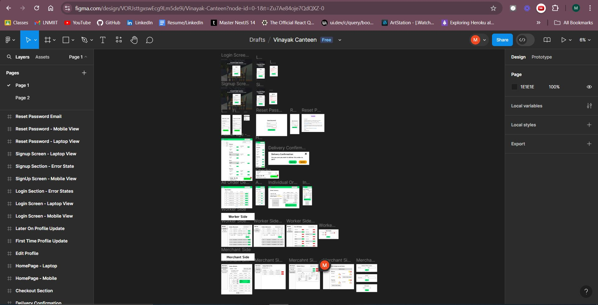

# Vinayak Canteen Website

Server-side Repository is present at <a href="https://github.com/mr-kingshuk/vinayak-night-canteen-server" target="_blank" rel="noopener noreferrer">vinayak-night-canteen-server</a> 


## Table of Contents
1. [Problems Faced in College](#problems-faced-in-college)
2. [Solution Provided by This Software](#solution-provided-by-this-software)
3. [Proof of Work](#proof-of-work)
4. [Planning and Designing](#planning-and-designing)
5. [Running Loaclly](#running-locally)
6. [Dependencies](#dependencies)
7. [Environment Variables](#environment-variables)
8. [Workflow Diagrams](#workflow-diagrams)
9. [Pages](#pages)
    - [Guest Pages](#guest-pages)
    - [User Pages](#user-pages)
    - [Worker Pages](#worker-pages)
    - [Merchant Pages](#merchant-pages)
10. [Central State Management](#central-state-management)
11. [Custom Auth Hooks](#custom-auth-hooks)
12. [Contributing](#contributing)    
13. [License](#license)

## Problems Faced in College

So, last year in 2023, access to food at late night was limited due to the fact that after **10:45 PM (our hostel in-time)**, hot food was only available via phone orders to the Vinayak Store, which often led to a few problems:

1. <ins>**Inefficient Communication**</ins> between the Vinayak Store and customers led to <ins>**late deliveries**</ins>, missed orders due to <ins>**unreceived calls**</ins>, and <ins>**incorrect orders**</ins> due to confusion between orders, causing significant frustration among users.

2. Lack of motivation among late-night workers led to delays in food preparation, and declining Quality of Service (QoS), resulting in repeated student complaints and a cycle of dissatisfaction that further demotivated workers.

3.  The <ins>**Store Owner of Canteen**</ins> felt that the store's reputation was being tarnished due to service inefficiencies, despite having sufficient stock, which led to complaints within the college.

This was all due to <ins>**Lack of Central Monitoring**</ins>, which left students uninformed about order status and inventory levels, leading to confusion and misconceptions. The store owner’s lack of visibility into orders and stock sometimes resulted in workers lying about item availability to reduce their workload.

Addressing these issues is crucial for improving the operational environment for the **Vinayak Store** and Night Canteen as a whole.

## Solution Provided by This Software
To address these challenges, I developed a comprehensive Night Canteen Website for Vinayak Canteen. The platform features a 3-tier user role system, including **`User`**, **`Worker`**, and **`Merchant`** profiles. Key functionalities include:

- <ins>**Integrated Razorpay**</ins> for secure payments, ensuring a smooth transaction process, ensuring pre-payment of orders, to allow order confirmation, from both Store as well as Student side
- <ins>**Cron jobs**</ins> to manage item availability based on store timings, automatically toggling items off when the store closes and on when it opens, managed by the store owner.
- <ins>**Manual control of items**</ins> through the Worker interface, allowing for dynamic menu management, which is visible to the Store Owner as well. 
- <ins>**Central State Management**</ins> to efficiently handle the state of User Details and Order Details, enabling users to add items to the cart from both the Menu HomePage and the Order Summary Page.
- <ins>**Use of localStorage**</ins> to persist User and Order Details, allowing for easy access when the User returns to the website later.
- A robust <ins>**CMS portal**</ins> for Merchants to manage menu items and store timings, along with a <ins>**CRM portal**</ins> to track all orders, including cancelled and delivered orders.
- <ins>**Responsive Design**</ins> for all three user roles, ensuring a seamless experience across devices, whether on desktop, tablet, or mobile.

This project highlights advanced web development skills with a focus on real-time communication, payment integration, and efficient store management.

## Proof of Work 

This project has received formal approval from **Dr. Nabyendu Das**, Chief Warden of The LNM Institute of Information Technology, Jaipur, signifying its alignment with the institute's goals and objectives.


> *Screenshot of the email from the Chief Warden of my college, confirming the approval of the project.*

# Planning and Designing

This section highlights the planning and design process behind the project. The design focuses on creating a ser-friendly experience and a visually appealing interface. The design files created in Figma serve as the foundation for the application's layout, components, and overall user experience.



> *View the complete design file on Figma: <a href="https://www.figma.com/design/VORJsttgxswEcg9Lm5de9i/Vinayak-Canteen?node-id=0-1&m=dev&t=Zu7Ae84oje7QdQXZ-1" target="_blank" rel="noopener noreferrer">Figma Design File Link</a>*

## Running Locally

To set up the project locally, follow these steps:

0. **Clone the repositories**:
   - For the server: 
     ```
     git clone https://github.com/mr-kingshuk/vinayak-night-canteen-server.git
     ```
   - For the client: 
     ```
     git clone https://github.com/mr-kingshuk/vinayak-night-canteen-client.git
     ```

1. **Fill the `.env` file**: 
   - Use the `template.env` file as a reference to configure your environment variables.

2. **Set up the database connection in server**:
   - Add the database connection string for both production and development environments.
   - Set `NODE_ENV` to `development`. (When pushing code to production, change `NODE_ENV` to `production`.)

3. **Install dependencies and run the server and client**:
   - Navigate to the server folder:
     ```bash
     cd vinayak-night-canteen-server
     npm install
     npm run dev
     ```
   - Then, navigate to the client folder:
     ```bash
     cd ../vinayak-night-canteen-client
     npm install
     npm start
     ```

4. **Create a new account**:
   - Sign up for a new account that you want to have Merchant access.

5. **Upgrade user to Merchant role**:
   - Add the following entry to the `userTypes` collection in the database:
     ```json
     {"userId":{"$oid":"MongoDb _id for merchant user"},"type":"merchant"}
     ```
   - Alternatively, call the POST endpoint to upgrade the user:
     ```
     POST http://localhost:3000/merchant
     ```
     - Include the Authorization token (JWT Token, returned as a response after logging in or signing up) in the request header.

6. **Add Categories, Items, and Store Timing**:
   - Configure categories and items, set store timings, and create worker profiles.

7. **Project Ready**:
   - Your project is now ready for use by user, worker, and merchant profiles.

## Dependencies

```json
  "dependencies": {
    "moment": "^2.29.4",
    "react": "^18.2.0",
    "react-datepicker": "^4.23.0",
    "react-dom": "^18.2.0",
    "react-router-dom": "^6.17.0",
    "react-scroll": "^1.9.0"
  },
  "devDependencies": {
    "@types/react": "^18.2.15",
    "@types/react-dom": "^18.2.7",
    "@vitejs/plugin-react": "^4.0.3",
    "eslint": "^8.45.0",
    "eslint-plugin-react": "^7.32.2",
    "eslint-plugin-react-hooks": "^4.6.0",
    "eslint-plugin-react-refresh": "^0.4.3",
    "vite": "^4.4.5"
  }
```
## Environment Variables

To run this project, you will need to add the following environment variables to your `.env` file:

- `VITE_API_BASE_URL`: The base URL of the server where the backend is hosted.

## Workflow Diagrams

The following diagrams illustrate the communication between the client and server for two major workflows utilized in this project.

### Razorpay Payment Verification Workflow

> *This diagram depicts the two-step verification process between the client and server for Razorpay payment verification.*

### Reset Password Workflow

> *This diagram illustrates the two-step verification process between the client and server for the reset password functionality.*

### Pages

## Guest Pages

<ins>1. Signup Page</ins>


> *This video illustrates the Signup Page and all its error handling in a brief manner.*

<ins>2. Login Page</ins>


> *This video illustrates the Login Page and all its error handling in a brief manner.*

<ins>3. Reset and Forget Password Pages</ins>


> *This video illustrates the forgot password page, the rest email, and the subsequent redirection to the rest page and their respective error handling.*

## User Pages

<ins>1. HomePage, Update Profile Pgae, Order Page </ins>


> *This video illustrates the homepage, the cart feature, the Profile Update page which is necesary before every order, and for 1st time users, Razorpay Payment Gateway and finally the Order page on succesful order placement.*

<ins>2. Order(s) Page and Order Page </ins>


> *This video shows the Orders Page which has an <ins>Infinite Scroll Feature</ins> and the subsequent redirection to the Order page, on clciking any order.*

<!-- ## Worker Pages 

<ins>1. Received Order Page </ins>


> *This diagram illustrates the two-step verification process between the client and server for the reset password functionality.*

<ins>2. Items On/Off Page </ins>


> *This diagram illustrates the two-step verification process between the client and server for the reset password functionality.*

## Merchant Pages

<ins>1. Order Details Page </ins>


> *This diagram illustrates the two-step verification process between the client and server for the reset password functionality.*

<ins>2. Store Details Page </ins>


> *This diagram illustrates the two-step verification process between the client and server for the reset password functionality.*

<ins>3. Cancelled Orders Page </ins>


> *This diagram illustrates the two-step verification process between the client and server for the reset password functionality.*

<ins>4. Items and Category Page </ins>


> *This diagram illustrates the two-step verification process between the client and server for the reset password functionality.* -->

## Central State Management

Central State Management in this project is implemented using React's `Context API` and the `useReducer` hook, providing a way to efficiently manage and share state across components. This documentation covers two main contexts used for state management: <ins>**AuthContext**</ins> and <ins>**OrderContext**</ins>.

<ins>1. AuthContext</ins>

The **AuthContext** manages user authentication state, including login, signup, logout, and updates to user details.

| **Action** | **Description**                                                |
|------------|---------------------------------------------------------------|
| **LOGIN**  | Updates the state with the authenticated user's information.  |
| **SIGNUP** | Registers a new user and updates the state.                   |
| **LOGOUT** | Resets the user and user details to `null`.                   |
| **UPDATE** | Updates the user's details while preserving their identity.    |

- **Reducer and Provider**: The `authReducer` handles state transitions based on dispatched actions, while the **AuthContextProvider** wraps the application to provide authentication state and dispatch function to its children. It initializes the state from `localStorage` to maintain the user's authentication status across sessions.

<ins>2. OrderContext</ins>

The **OrderContext** manages the state of order items, allowing components to modify orders.

| **Action**       | **Description**                                                          |
|------------------|-------------------------------------------------------------------------|
| **ADD**          | Initializes the order with a given array of items.                     |
| **INCREMENT**    | Increases the quantity of a specific item.                              |
| **DECREMENT**    | Decreases the quantity, removing the item if it reaches zero.           |
| **REMOVE**       | Clears all items from the order.                                       |
| **REMOVE_SINGLE**| Removes a specific item from the order.                                 |

- **Reducer and Provider**: The `orderReducer` handles state changes based on dispatched actions, ensuring the order state updates correctly. The **OrderContextProvider** wraps the application to provide order state and dispatch function to its children, utilizing `localStorage` to persist the order state across sessions.

## Custom Auth Hooks

This project includes three custom hooks that utilize the **AuthContext** to manage user authentication: **useLogin**, **useLogout**, and **useSignup**. Each hook provides specific functionalities to streamline authentication processes in the application.

### 1. **useLogin**

The **useLogin** hook handles the user login process. The **login(email, password)** function, which the hook returns sends a POST request to the login API endpoint. If the login is successful, it updates the local storage with the user's information and dispatches the login action to the AuthContext. This hook also returns `error` which contains value of any error encountered during the login attempt and `isLoading` which indicates whether the login process is ongoing.

### 2. **useSignup**

The **useSignup** hook manages user registration. The **signup(email, password, reEnterPassword, name)** function, which the hook returns, sends a POST request to the signup API endpoint. Upon successful registration, it saves the user information to local storage and dispatches the signup action to the AuthContext. This hook also returns `error` which contains value of any error encountered during the signup attempt and `isLoading` which indicates whether the signup process is ongoing.

### 3. **useLogout**

The **useLogout** hook manages user logout. The function **logout()**, which is returned from this hook removes user information and order data from local storage. It dispatches a logout action to the AuthContext and a remove action to the OrderContext.

## Contributing

Thank you for considering contributing to the Vinayak Canteen Website project! We welcome contributions from the community to improve and enhance the application. Here's how you can contribute:

### 1. Fork the Repository

- Click the "Fork" button in the top-right corner.
- **Star the repository** to show your support and check the **Issues tab** for any tasks you might be interested in.

### 2. Clone the Repository

- Clone your forked repository to your local machine:

    ```bash
    git clone https://github.com/mr-kingshuk/vinayak-night-canteen-server.git
    ```

- Run this code on your local machine. Check [Running Locally](#running-locally) for more details.    

### 3. Create a New Branch

- Create a new branch for your feature or bug fix:

    ```bash
    git checkout -b feature/your-feature-name
    ```

### 4. Make Your Changes

- Implement your feature or fix the bug following the project's coding guidelines.

### 5. Commit Your Changes

- Commit your changes with a clear and descriptive message:

    ```bash
    git commit -m "Add your detailed message here"
    ```

### 6. Push to Your Branch

- Push your changes to your branch:

    ```bash
    git push origin feature/your-feature-name
    ```

### 7. Open a Pull Request

- Go to the original repository and open a pull request. Provide a detailed description of the changes you’ve made.

### Reporting Issues and Suggestions

If you encounter any issues or have questions, feel free to open an issue in the repository. Please provide detailed information to help us address the issue effectively. We're also always open to suggestions for improvement. If you have an idea, open an issue to discuss it with the maintainers and the community.

## License

**Copyright (c) 2024 Kingshuk Ghosh** — Licensed under the MIT License. [MIT License Link](https://opensource.org/license/mit)
